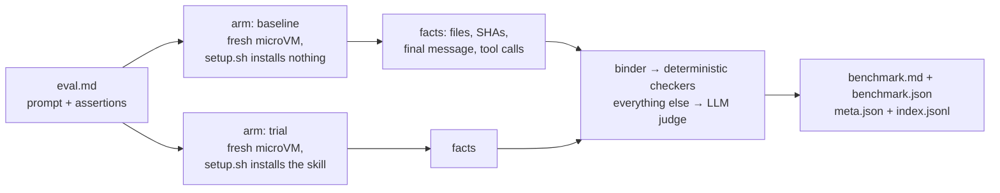

# evalspec

evalspec is a benchmark framework for coding agents. You write evals as Markdown —
a prompt plus a checklist of plain-prose assertions — and evalspec runs each one
across the named **arms** of a benchmark (Claude Code vs. Codex, sonnet vs. opus,
with the skill vs. without), each arm inside its own microVM. The results come back
as a matrix: evals down the side and arms across the top. When the set configures
a baseline, each comparison cell includes its percentage-point delta.

> evalspec is like a test runner for agent behavior: pytest underneath, but the
> unit of measurement is what an agent *did* in an isolated workspace — the files
> it wrote, the skills it invoked, the claims its output satisfies.

> **Status: alpha.** One production consumer. Breaking changes are possible before
> 1.0; the eval format and artifact schemas are the most likely surfaces to move.

## The measurement is a comparison

A single pass rate is just a number. Whether 60% is good depends entirely on what
the same agent scores *without* your skill, or on a cheaper model, or under a
different harness. An **eval set** lets you run the same eval across several arms.
When the set names a **baseline** arm, evalspec reports every other arm's delta
against it in percentage points; without a baseline, it reports absolute rates.

The primary output is a matrix, written as `benchmark.md` after every run:

| Eval | baseline (claude-code) | trial (claude-code) |
|------|------|------|
| archive/archive-source-from-inbox | 67% | 100% (+33pp) |
| archive/summarize-long-transcript | 50% | 83% (+33pp) |
| archive/choose-right-capability | 100% | 75% (-25pp) |
| All evals | 72% | 86% (+14pp) |

Rows are evals and columns are arms. When configured, the baseline column comes
first and every non-baseline cell carries both its absolute rate and its delta.
An `All evals` footer rolls each arm up to its headline number.

## An eval is one Markdown file

Here is a complete eval — `skills/archive/evals/archive-source-from-inbox/eval.md`:

```markdown
---
history:
- role: user
  content: Here's a capture for later — ./Inbox/openai-o1-launch.md.
- role: assistant
  content: Got it — say the word and I'll file it.
---

## Prompt

You are working in a knowledge-base vault rooted at your current working directory.
An unprocessed capture sits at './Inbox/openai-o1-launch.md'. Archive it: move it
into the vault's archive as a dated source, and record the move in the activity log.

## Assertions

- [ ] The capture now lives at ./9. Archive/Sources/{TODAY}/openai-o1-launch.md
- [ ] The activity log names both the Inbox source path and the archived destination
- [ ] Skill `archive` invoked
```

Three things to notice:

- **Assertions are prose.** There is no checker syntax to learn. At grade time a
  small classifier (the **binder**) maps each line to a deterministic check when it
  can do so without risk — `file_exists`, `regex`, `sha256_match`,
  `skill_invoked`, and friends — and punts everything else to an LLM **judge**
  that grades only from collected evidence: the final workspace tree, file
  contents, checksums, the agent's final message, and the tools it called.
- **Activation is just an assertion.** `` Skill `archive` invoked `` grades
  against the process facts of the run — which skills the agent actually
  dispatched — the same way a file assertion grades against the workspace.
- **The `history:` frontmatter is optional context**, rendered as a transcript
  prefix before the graded prompt, so multi-turn setups work on any harness.

## How a run works



Each `(eval × arm)` pair becomes one parametrized pytest test. The arm boots a
fresh microVM from a cached snapshot, seeds the eval's `workspace/` files into a
clean room mounted at `/workspace`, runs the eval's own `setup.sh` (which branches
on `$EVALSPEC_ARM` — the baseline arm installs nothing), and invokes the agent.
The agent's workdir starts with nothing but the eval's `workspace/` files — no
docs, peers, or project state are copied into it. The repo is also mounted
read-only at `/project` so `setup.sh` can install the skill under test. The agent
can read that mount, so prompts and harness arguments should not direct it there
unless repo access is part of the experiment; neither the agent nor `setup.sh`
can write back into your checkout.

## Vocabulary

| Concept | Meaning |
|---|---|
| **Eval** | One task: prompt, optional history, prose assertions. One `eval.md` or `<stem>.eval.md` file. |
| **Arm** | One benchmark column: a named harness × model × effort × env configuration. |
| **Eval set** | A named benchmark: arms, shared defaults, a baseline, a runner and sandbox. One set is the `default-set`. |
| **Baseline** | The arm every other arm's delta is measured against. Optional. |
| **Harness** | The agent CLI under test: `claude-code`, `codex`, or `opencode`. Chosen per arm. |
| **Binder** | The prose→checker classifier. Binds an assertion to a deterministic check or punts to the judge. |
| **Judge** | The LLM grader for punted assertions. Runs on the host, configured once per run, independent of the arms. |
| **Iteration** | One run's artifact tree: `tmp/evals/iteration_NN/`. |

## Getting started

```bash
pip install "evalspec[microsandbox]"
```

evalspec needs Python 3.11+, an Apple Silicon Mac or Linux with `/dev/kvm`, an
agent CLI on `$PATH` with a credential, and `GEMINI_API_KEY` for the binder (a
repo-root `.env` is loaded automatically). Declare a set in `pyproject.toml`:

```toml
[tool.evalspec]
default-set = "default"

[tool.evalspec.sets.default]
harness = "claude-code"
model = "sonnet"
baseline = "baseline"
arms = [
  { name = "baseline" },   # installs no skill — measures what the agent already knows
  { name = "trial" },      # setup.sh installs the skill
]
```

Then lint, preview, and run:

```bash
evalspec lint      # static checks: catches unjudgeable assertions before you spend
evalspec analyze   # how will each assertion grade — deterministic or judge-backed?
evalspec run       # the benchmark: every (eval × arm), sandboxed, graded, reported
```

`evalspec run` is pytest underneath — everything after `--` passes through
verbatim, so `evalspec run -- -k archive-source-from-inbox` (equivalently
`pytest -k archive-source-from-inbox`) scopes the run to one eval, `-n 8` fans
arms out across microVMs, and `--count 5` samples each cell five times for
stability (the latter two via the pytest-xdist and pytest-repeat plugins).

## Why evalspec

Most eval frameworks grade a model's *output*. evalspec grades an agent's
*behavior* — inside a sandbox, comparatively, and reproducibly:

- **Comparison is first-class.** Configure several arms and a baseline to make the
  headline a delta; omit the baseline when absolute rates are what you need.
- **Deterministic where possible, judged where necessary.** The binder is tuned so
  a false positive (a surface check passing on wrong output) is the one
  unacceptable error; anything doubtful goes to the judge, which sees evidence,
  not vibes.
- **Self-describing artifacts.** Every run writes `meta.json` (planned config plus
  observed runtime provenance) and `index.jsonl` (one row per sample), so external
  tooling aggregates on metadata alone.

Some deliberate bets you inherit: microsandbox is the only sandbox backend today
(`docker` is named but fails fast as not implemented); the judge runs on the host
so one grader spans the whole matrix; and cross-harness pass rates are an
integration signal, not a leaderboard — harnesses differ in more than their model.

## Documentation

- [`docs/quickstart.md`](docs/quickstart.md) — zero to your first benchmark run.
- [`docs/writing-evals.md`](docs/writing-evals.md) — the eval format, workspaces, `setup.sh`, and how grading works.
- [`docs/configuration.md`](docs/configuration.md) — eval sets, arms, the judge, every CLI flag, exit codes.
- [`docs/sandbox.md`](docs/sandbox.md) — the microVM lifecycle: snapshots, caching, mounts, credentials.
- [`docs/results.md`](docs/results.md) — reading `benchmark.md` and the machine-readable artifacts.
- [`docs/harnesses.md`](docs/harnesses.md) — `claude-code`, `codex`, `opencode`, and adding your own.
- [`docs/style/development.md`](docs/style/development.md) — code style for contributors.
