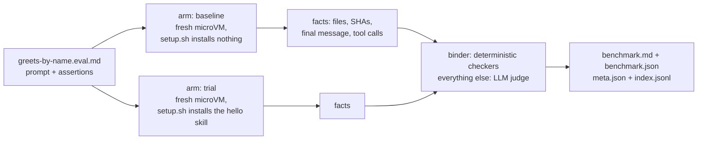

<picture>
  <source media="(prefers-color-scheme: dark)" srcset="docs/assets/harnessbench-wordmark-dark.svg">
  
</picture>

**Benchmark what your agent does, not what it says.**

[](https://github.com/theycallmeswift/harnessbench/actions/workflows/ci.yml)
[](https://pypi.org/project/harnessbench/)
[](https://pypi.org/project/harnessbench/)
[](LICENSE)

harnessbench runs an agent (Claude Code, Codex, or OpenCode) against a task
in a fresh microVM, checks what it actually did in the workspace, and reports the
result as a comparison: with your skill versus without, one model versus another,
one harness versus another.

| Eval | baseline (claude-code) | trial (claude-code) |
|------|------|------|
| hello/greets-by-name | 33% | 100% (+67pp) |
| hello-file/writes-greeting-file | 50% | 50% (+0pp) |
| All evals | 40% | 80% (+40pp) |

*Example output: the `benchmark.md` from a two-arm run of the in-repo
[`hello`](evals/e2e/hello/) suite, with illustrative numbers.* Rows are evals,
columns are arms (`baseline` ran the agent bare, `trial` installed the skill),
and every non-baseline cell shows its assertion pass rate plus the delta against
the baseline in percentage points.

## Sixty seconds

An eval is one Markdown file: a prompt, then a checklist of plain-prose claims
about the workspace after the agent is done. There is no checker syntax to learn;
the wording is the spec. `evals/hello/greets-by-name.eval.md`:

```markdown
---
---

## Prompt

You are working in a workspace rooted at your current working directory.
Greet Alice by name.

## Assertions

- [ ] ./Greetings/Alice.md contains the exact line 'Hello, Alice!'
- [ ] Skill `hello` invoked
- [ ] The greeting feels warm and personable, not curt or robotic
```

The benchmark is a block in `pyproject.toml`. Arms are the report columns; the
baseline is what the others are measured against:

```toml
[tool.harnessbench]
default-set = "default"

[tool.harnessbench.sets.default]
harness  = "claude-code"
model    = "sonnet"
baseline = "baseline"
arms = [
  { name = "baseline" },   # installs nothing
  { name = "trial" },      # setup.sh installs the skill
]
```

Then:

```bash
harnessbench lint      # static checks on the assertions
harnessbench analyze   # which assertions grade deterministically, which go to the judge
harnessbench run       # every (eval × arm) in its own microVM, graded, reported
```

## What you need

```bash
pip install "harnessbench[microsandbox]"
```

| | |
|---|---|
| Platform | Apple Silicon Mac, or Linux with `/dev/kvm`. Python 3.11+. |
| Agent CLI | `claude`, `codex`, or `opencode` on `PATH`, with its credential (for Claude Code, `CLAUDE_CODE_OAUTH_TOKEN` or `ANTHROPIC_API_KEY`). |
| `GEMINI_API_KEY` | The binder: a fixed Gemini call that classifies each assertion. Required for every `analyze` and `run`. |
| Judge credential | The judge runs on the host through an agent CLI; the default is `claude-code` with `sonnet`. Prefer a different vendor from the arms (this repo's own suite judges Claude arms with Codex). |

Credentials can live in a repo-root `.env`. A graded run can touch up to three
vendors: the agent's, Gemini for the binder, and the judge's. `lint` is free;
`analyze` and `run` spend API calls, and `run` also boots VMs. Preflight lists
every missing piece and exits before anything is spent.

## How a run works



Each `(eval × arm)` pair is one parametrized pytest test. The cell boots a
microVM from a cached snapshot that already has the agent CLI installed, seeds
the eval's optional `workspace/` files into a clean room mounted at `/workspace`,
runs the eval's `setup.sh` if there is one, and invokes the agent with
`/workspace` as its working directory. `setup.sh` is where arms diverge: it sees
`$HARNESSBENCH_ARM`, so the baseline branch exits early and the trial branch
copies the skill into place. When the agent finishes, the host collects the
facts (file tree, contents, SHA-256s, final message, tool calls), the binder maps
each assertion to a deterministic checker where it can do so without risk, and
the judge grades the rest from that evidence alone. The first run builds the
snapshot (a few minutes to pull the base image and install the agent CLI); every
later run boots from it, or pay that cost up front with `harnessbench sandbox:build`.

The clean room is the whole world the agent starts in. A staged copy of your
repo (what a `git clone` would contain, never `.env`, `.git`, or earlier runs'
artifacts) is mounted read-only at `/project` so `setup.sh` can reach the skill
under test. Nothing in the guest can write back to your checkout, and provider
credentials are injected at the network boundary rather than as readable
environment variables.

`harnessbench run` is pytest underneath, and everything after `--` goes to
pytest verbatim: `harnessbench run -- -k greets-by-name` (equivalently
`pytest -k greets-by-name`) runs one eval, `-n 8` fans cells across eight
microVMs, and `--count 5` samples each cell five times so the report can flag a
delta that sits within noise.

## Why harnessbench

- **Comparison is first-class.** A single pass rate is a number without a
  reference point. Arms and a baseline make the headline a delta; skip the
  baseline when absolute rates are what you want.
- **Deterministic where possible, judged where necessary.** The binder is tuned
  so a false positive, a surface check passing on wrong output, is the one
  unacceptable error; anything doubtful goes to the judge, which sees the
  collected evidence and never grades from recall.
- **Self-describing artifacts.** Every run writes `meta.json` (planned config
  plus observed provenance, down to the agent version inside the guest),
  `index.jsonl` (one row per sample), and `benchmark.json`, so other tools can
  aggregate runs without knowing the directory layout.

### Not for you if

- You have no Apple Silicon Mac and no Linux host with KVM. Windows is not
  supported.
- You want a hosted leaderboard. harnessbench writes files into your repo;
  cross-harness columns are an integration signal, not a ranking.
- You want to grade single model outputs. harnessbench measures agent behavior
  in a workspace, not text completions.

## Status

Alpha. The eval format and the artifact schemas (`meta.json`, `index.jsonl`,
`benchmark.json`) are the surfaces most likely to change before 1.0. microsandbox
is the only sandbox backend; `docker` is recognized in config but fails fast as
not implemented. Ahead: a docker backend and more deterministic checkers, so
fewer assertions need the judge. The judge runs on the host so one grader spans
the whole matrix; that is deliberate and will stay.

## Documentation

| | |
|---|---|
| [`docs/quickstart.md`](docs/quickstart.md) | Empty directory to a graded two-arm run. |
| [`docs/concepts.md`](docs/concepts.md) | The vocabulary: eval, arm, set, baseline, binder, judge. |
| [`docs/writing-evals.md`](docs/writing-evals.md) | The eval format, workspaces, `setup.sh`, and how grading decides what binds. |
| [`docs/configuration.md`](docs/configuration.md) | Sets, arms, the judge, every CLI flag, exit codes. |
| [`docs/sandbox.md`](docs/sandbox.md) | Snapshots, mounts, credentials, host requirements. |
| [`docs/results.md`](docs/results.md) | Reading `benchmark.md` and the machine-readable artifacts. |
| [`docs/harnesses.md`](docs/harnesses.md) | `claude-code`, `codex`, `opencode`, and adding your own. |

## Contributing

Issues and pull requests are welcome at
[github.com/theycallmeswift/harnessbench](https://github.com/theycallmeswift/harnessbench).
Until `CONTRIBUTING.md` lands, [`docs/style/development.md`](docs/style/development.md)
is the code style, and `make test` plus `make lint` are the bar.

## License

[MIT](LICENSE).
