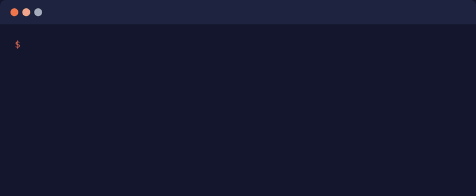

<picture>
  <source media="(prefers-color-scheme: dark)" srcset="docs/assets/benchspec-wordmark-dark.svg">
  
</picture>

**Benchmark what your agent does, not what it says.**

[](https://github.com/theycallmeswift/benchspec/actions/workflows/ci.yml)
[](https://pypi.org/project/benchspec/)
[](https://pypi.org/project/benchspec/)
[](LICENSE)

benchspec runs an agent (Claude Code, Codex, or OpenCode) against a task
in a fresh sandbox, checks what it actually did in the workspace, and reports the
result as a comparison: with your skill versus without, one model versus another,
one harness versus another.



*End-of-run summary for a two-arm run of the in-repo [`hello`](evals/e2e/hello/)
suite (illustrative numbers).* Rows are evals, columns are arms (`baseline` ran
the agent bare, `trial` installed the skill), and every non-baseline cell shows
its assertion pass rate plus the delta against the baseline in percentage
points. The same matrix lands in `benchmark.md`, with machine-readable artifacts
alongside.

Teams pick harnesses, models, and prompts by anecdote: run it once, eyeball the
transcript, trust the vibe. benchspec turns that guess into a measurement.
Write the goal once, run it across the configurations you care about, and read
off — in percentage points — how good each one actually is at accomplishing it.

> **When to use benchspec.** If the question is only whether one plugin helps
> Claude Code, Claude Code's built-in `claude plugin eval` answers it with one
> credential and no sandbox. benchspec is for the next questions: which harness,
> which model, which configuration; tasks that start from real files; and checks
> on what the workspace looks like afterward, including that seeded files were
> left alone. [benchspec vs. the alternatives](#benchspec-vs-the-alternatives)
> places it against four other tools.

## What you need

| | |
|---|---|
| Platform | Any OS with a Docker daemon (default). Apple Silicon or Linux with `/dev/kvm` for the microsandbox opt-in. Python 3.11+. |
| Agent CLI | `claude`, `codex`, or `opencode` on `PATH`, with its credential (for Claude Code, `CLAUDE_CODE_OAUTH_TOKEN` or `ANTHROPIC_API_KEY`). |
| Binder credential | The binder is a fixed model call that classifies each assertion, required for every `analyze` and `run`: `GEMINI_API_KEY` by default, or `OPENROUTER_API_KEY` with `[tool.benchspec.binder] provider = "openrouter"`. |
| Judge credential | The judge runs on the host through an agent CLI, using either its env credential or the CLI's own login (`claude login`, `codex login`); the default is `claude-code` with `sonnet`. Prefer a different vendor from the arms (this repo's own suite judges Claude arms with Codex). |

Credentials can live in a repo-root `.env`. A graded run can touch up to three
vendors: the agent's, the binder's, and the judge's. Or exactly one: set
`provider = "openrouter"` on the binder, the judge, and the arms, and the whole
run needs only `OPENROUTER_API_KEY` (see
[`configuration.md`](docs/configuration.md#providers)). `lint` is free;
`analyze` and `run` spend API calls, and `run` also boots sandboxes. Preflight
lists every missing piece and exits before anything is spent.

## Getting Started

```bash
pip install benchspec
```

For the microsandbox isolation opt-in, add its extra:

```bash
pip install "benchspec[microsandbox]"
```

> **Pre-1.0.** The eval format and the artifact schemas are the surfaces most
> likely to change.

An eval is one Markdown file: a prompt, then a checklist of plain-prose claims
about the workspace after the agent is done. There is no checker syntax to learn;
the wording is the spec. `evals/hello/greets-by-name.eval.md`:

```markdown
---
---

## Prompt

You are working in a workspace rooted at your current working directory.
Greet Alice by name.

## Assertions

- [ ] ./Greetings/Alice.md contains the exact line 'Hello, Alice!'
- [ ] Skill `hello` invoked
- [ ] The greeting feels warm and personable, not curt or robotic
```

The benchmark is a block in `pyproject.toml`. Arms are the report columns; the
baseline is what the others are measured against:

```toml
[tool.benchspec]
default-set = "default"

[tool.benchspec.sets.default]
harness  = "claude-code"
model    = "sonnet"
baseline = "baseline"
arms = [
  { name = "baseline" },   # installs nothing
  { name = "trial" },      # setup.sh installs the skill
]
```

Then:

```bash
benchspec lint      # static checks on the assertions
benchspec analyze   # which assertions grade deterministically, which go to the judge
benchspec run       # every (eval × arm) in its own sandbox, graded, reported
```

The `` Skill `hello` invoked `` line needs a skill for the trial arm to install
and a `setup.sh` that installs it; the [quickstart](docs/quickstart.md) writes
both and takes an empty directory to that first graded report.

## How a run works


Each `(eval × arm)` pair is one parametrized pytest test. A cell:

1. **Boots a sandbox** — a Docker container by default, or a microsandbox
   microVM for the opt-in — from a cached snapshot with the agent CLI already
   installed. The first run builds the snapshot (about a minute); later runs
   reuse it. `benchspec sandbox:build` pays that cost up front,
   `benchspec sandbox:clean` reclaims the disk.
2. **Seeds the clean room** — the eval's optional `workspace/` files land in a
   fresh directory mounted at `/workspace`, the agent's working directory.
3. **Runs `setup.sh`**, where arms diverge: it sees `$BENCHSPEC_ARM`, so the
   baseline branch exits early and the trial branch copies the skill into place.
4. **Invokes the agent** on the eval's prompt.
5. **Collects the facts** — file tree, contents, SHA-256s, the final message,
   the tool calls.
6. **Grades** — the binder maps each assertion to a deterministic checker where
   it can do so without risk; the judge grades everything else from the
   collected evidence alone.

On either backend, nothing in the guest can write back to your checkout:
`setup.sh` reaches the skill under test through a read-only staged copy of your
repo at `/project` (what a `git clone` would contain — never `.env`, `.git`, or
earlier runs' artifacts). Credential exposure differs — microsandbox injects each
credential at the network boundary, Docker as a plain container environment
variable the agent can read. [`sandbox.md`](docs/sandbox.md) has the tradeoff.

`benchspec run` is pytest underneath, and everything after `--` goes to
pytest verbatim. The normal run is `benchspec run -- --count 3`: three samples
per cell (pytest-repeat), so every delta carries a noise band; a one-sample run
is flagged in the report. `-n 8` fans cells across eight sandboxes to keep it
fast, and `-k greets-by-name` (equivalently `pytest -k greets-by-name`) runs one
eval. The repo's own `make e2e` defaults to six workers through the `WORKERS`
variable; `make e2e WORKERS=1` runs the cells sequentially.

## benchspec vs. the alternatives

benchspec is not the only way to measure an agent, and for a narrow enough
question it is not the fastest. Four things it does that the others do not:

- **Any arms, not two.** Harness, model, effort, env, and provider per arm;
  three harnesses in one set; a `--models` sweep. The report is the matrix.
- **A real workspace.** The eval's `workspace/` seed is copied into a clean room
  and hashed before the agent starts, so `left unchanged` is a decidable claim
  and not just `was created`.
- **Prose assertions, deterministic where possible.** No grader DSL: the binder
  binds each line to a mechanical checker where it can do so without risk and
  punts the rest to a judge that can be a different vendor from the arms.
- **Honest numbers.** Errored is not failed, every delta at two or more samples
  carries a noise band, and `meta.json` records the agent version observed
  inside the guest next to the config that was planned.

Where each alternative is the better answer:

| | Reach for it when | What benchspec adds |
|---|---|---|
| [`claude plugin eval`](https://code.claude.com/docs/en/plugin-evals) | The question is whether one plugin helps Claude Code. It is built into Claude Code, needs one credential and no container, and interviews you to write the suite. | A second harness, arms other than with-and-without, a seeded and hashed workspace, and a judge from another vendor. |
| [Inspect AI](https://inspect.aisi.org.uk/) | You write Python, and you want off-the-shelf evals, remote execution at scale, or `pass@k` reducers. | The eval is a Markdown file of prose claims rather than a scorer you implement, and the report is an arms-versus-baseline delta without assembling one. |
| [Harbor](https://www.harborframework.com/) / Terminal-Bench | You want to rank agents on a standard published benchmark, with a long list of agent CLIs already integrated. | Your tasks and your baseline. The question is whether your change helped, not where an agent sits on a leaderboard. |
| [Coder Eval](https://github.com/UiPath/coder_eval) | You want typed YAML criteria with weights and fractional credit, or its GitHub Action. | Prose assertions with no criterion schema to learn, pre-run hashes behind `left unchanged`, and a noise band on the delta. |
| [promptfoo](https://www.promptfoo.dev/) | What you are grading is a prompt and the reply it produced. | Grading of the workspace the agent left behind, rather than the sentence it wrote about what it did. |

A longer, sourced comparison — what each one's unit of evaluation, isolation,
and statistics actually are — is in
[`docs/research/2026-09-13-alternatives-landscape.md`](docs/research/2026-09-13-alternatives-landscape.md).

## Documentation

| | |
|---|---|
| [`docs/quickstart.md`](docs/quickstart.md) | Empty directory to a graded two-arm run. |
| [`docs/concepts.md`](docs/concepts.md) | The vocabulary: eval, arm, set, baseline, binder, judge. |
| [`docs/writing-evals.md`](docs/writing-evals.md) | The eval format, workspaces, `setup.sh`, and how grading decides what binds. |
| [`docs/configuration.md`](docs/configuration.md) | Sets, arms, the judge, every CLI flag, exit codes. |
| [`docs/sandbox.md`](docs/sandbox.md) | Snapshots, mounts, credentials, host requirements. |
| [`docs/results.md`](docs/results.md) | Reading `benchmark.md` and the machine-readable artifacts. |
| [`docs/harnesses.md`](docs/harnesses.md) | `claude-code`, `codex`, `opencode`, and adding your own. |

## Development

Clone to a graded run of the in-repo suite in four steps. Steps 1 and 2 cost
nothing; step 3 is the first paid call.

```bash
git clone https://github.com/theycallmeswift/benchspec && cd benchspec
```

1. **Install.** [`uv`](https://docs.astral.sh/uv/) manages the venv;
   `make install` runs `uv sync`. Then the free checks:

   ```bash
   curl -LsSf https://astral.sh/uv/install.sh | sh   # if you don't have uv
   make install
   make test     # unit suite: no credentials, no sandbox
   ```

2. **Confirm the suite collects.** Needs no credentials and no Docker:

   ```bash
   make e2e EVAL_ARGS="--collect-only -q"   # 9 cells: 3 evals × 3 arms, then 12 through OpenRouter
   ```

3. **Set up the credentials.** `make e2e` runs [`evals/e2e/hello/`](evals/e2e/hello/)
   twice: three evals across three Claude Code arms, judged by Codex; then the same
   evals across Claude Code, Codex, and OpenCode arms with the binder, the judge,
   and every arm on OpenRouter. It needs `claude` and `codex` on `PATH`, a running
   Docker daemon, and four credentials in `.env`:

   ```bash
   cp .env.example .env
   ```

   | Variable | For |
   |---|---|
   | `CLAUDE_CODE_OAUTH_TOKEN` (from `claude setup-token`) or `ANTHROPIC_API_KEY` | the arms |
   | `GEMINI_API_KEY` | the binder |
   | `OPENAI_API_KEY` | the Codex judge |
   | `OPENROUTER_API_KEY` | the second run: binder, judge, and arms through OpenRouter |

   Preflight lists every missing piece in one message and exits before anything
   is spent.

4. **Run it.** The cheapest real run is one eval, one sandbox:

   ```bash
   make e2e WORKERS=1 EVAL_ARGS="-k greets-by-name"   # one eval, sequential
   make e2e                                          # the whole suite, six sandboxes
   ```

   The first run builds the sandbox snapshot (about a minute); with the snapshot
   cached, the whole suite takes about a minute on six workers. The report lands
   in `tmp/evals/iteration_01/benchmark.md`.

Then `make lint` (ruff, ty, houserules; needs `GEMINI_API_KEY`) before a pull
request. On Claude Code on the web, the environment's setup script does steps 1
and 3 once for every session; see
[`sandbox.md`](docs/sandbox.md#claude-code-on-the-web).

Issues and pull requests are welcome at
[github.com/theycallmeswift/benchspec](https://github.com/theycallmeswift/benchspec).
Until `CONTRIBUTING.md` lands, [`docs/style/development.md`](docs/style/development.md)
is the code style, and `make test` plus `make lint` are the bar.

## License

[MIT](LICENSE).
